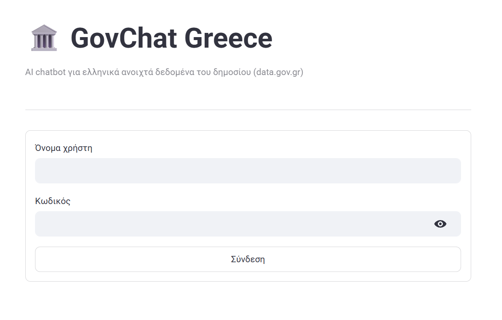
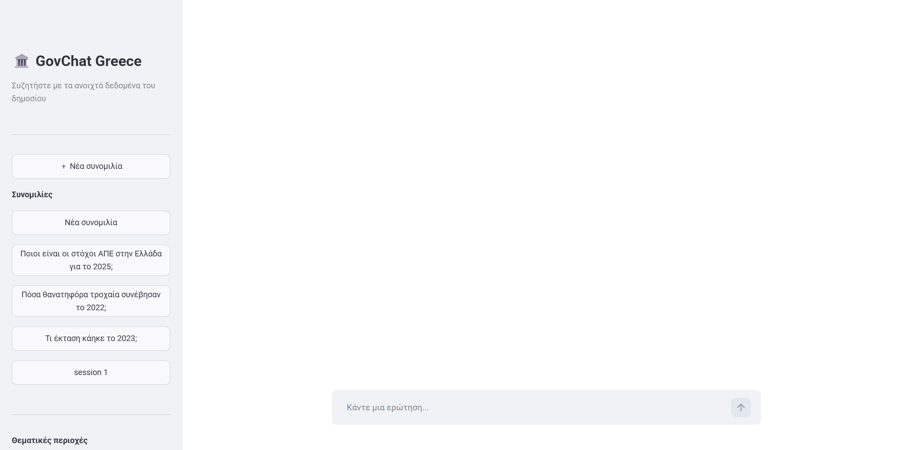
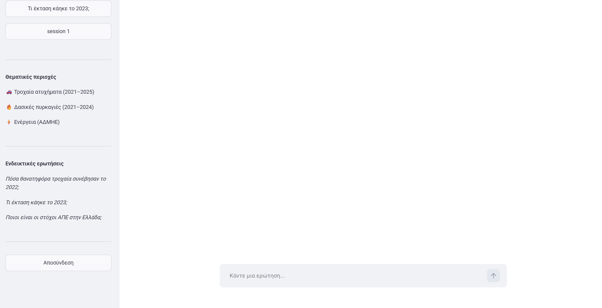
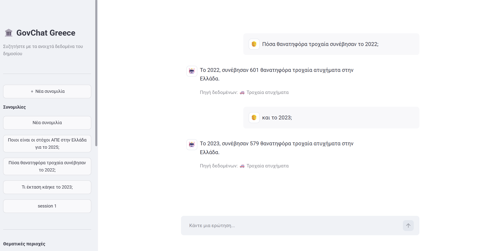

# GovChat Greece — Τεκμηρίωση Εφαρμογής

**Μάθημα:** AI for Developers — Athens University of Economics and Business  
**Τεχνολογίες:** FastAPI · OpenAI API · ChromaDB · Streamlit · SQLite

---

## 1. Τίτλος, Περιγραφή και Σκοπός

**GovChat Greece** είναι ένα AI chatbot που απαντά σε ερωτήσεις φυσικής γλώσσας (Ελληνικά και Αγγλικά) για ελληνικά ανοιχτά κυβερνητικά δεδομένα. Χρησιμοποιεί τεχνικές Generative AI — Prompt Engineering, RAG και AI Agents με Tool Calling — για να παρέχει ακριβείς, τεκμηριωμένες απαντήσεις βασισμένες σε πραγματικά δεδομένα.

**Σκοπός:** να επιδείξει ολοκληρωμένη εφαρμογή που ενσωματώνει GenAI λογική σε καθαρή αρχιτεκτονική software project, καλύπτοντας όλα τα θέματα του μαθήματος (FastAPI, Prompt Engineering, RAG, AI Agents).

---

## 2. Σενάριο Χρήσης και Λειτουργικές Απαιτήσεις

### Σενάριο Χρήσης

Ένας πολίτης, ερευνητής ή δημοσιογράφος θέλει γρήγορη πρόσβαση σε στατιστικά από ελληνικές κυβερνητικές πηγές χωρίς να χρειάζεται να ψάξει σε πολλές ιστοσελίδες. Το GovChat Greece επιτρέπει ερωτήσεις απευθείας σε φυσική γλώσσα και παρέχει απαντήσεις βασισμένες στα δεδομένα.

**Παραδείγματα ερωτήσεων:**
- "Πόσα θανατηφόρα τροχαία ατυχήματα συνέβησαν το 2023;"
- "Ποια χρονιά είχε τις χειρότερες δασικές πυρκαγιές στην Ελλάδα;"
- "Ποιο ήταν το ενεργειακό ισοζύγιο της Ελλάδας το 2023;"

### Λειτουργικές Απαιτήσεις

| Κατηγορία | Απαίτηση |
|-----------|----------|
| Αυθεντικοποίηση | Εγγραφή χρήστη, σύνδεση με JWT token, αποσύνδεση |
| Συνεδρίες | Δημιουργία πολλαπλών συνεδριών συνομιλίας ανά χρήστη |
| Ερωτήσεις | Υποβολή ερωτήσεων σε Ελληνικά ή Αγγλικά |
| Απαντήσεις | Απαντήσεις βασισμένες σε ανακτημένα δεδομένα (όχι γενική γνώση) |
| Θεματικές | Τροχαία ατυχήματα, δασικές πυρκαγιές, ηλεκτρική ενέργεια |
| Public API | Δημόσιο endpoint χωρίς εγγραφή για γρήγορα ερωτήματα |
| Ιστορικό | Αποθήκευση ιστορικού συνομιλιών ανά χρήστη |

---

## 3. Τεχνολογίες και Λόγος Επιλογής

| Τεχνολογία | Ρόλος | Λόγος Επιλογής |
|-----------|-------|---------------|
| **FastAPI** | Backend framework | Ταχύτητα, αυτόματο Swagger UI, Pydantic validation, async support |
| **SQLModel** | ORM / Pydantic schemas | Ενοποιεί SQLAlchemy + Pydantic σε ένα μοντέλο |
| **SQLite** | Σχεσιακή βάση δεδομένων | Μηδενική διαμόρφωση, ιδανικό για development |
| **OpenAI gpt-4o-mini** | LLM για agent | Εξαιρετική ισορροπία κόστους/απόδοσης, υποστηρίζει function calling |
| **OpenAI text-embedding-3-small** | Embeddings για RAG | Υψηλή ποιότητα, χαμηλό κόστος |
| **ChromaDB** | Vector store | Εύκολη εγκατάσταση, persistent αποθήκευση, Python-native |
| **Streamlit** | Frontend UI | Γρήγορη ανάπτυξη UI σε καθαρό Python χωρίς JavaScript |
| **python-jose + bcrypt** | Ασφάλεια | JWT tokens + password hashing (industry standard) |
| **pytest** | Testing | Integration tests με in-memory SQLite, χωρίς εξαρτήσεις |

---

## 4. Αρχιτεκτονική Εφαρμογής και Ροή Δεδομένων

### Αρχιτεκτονική επιπέδων

```
┌─────────────────────────────────────────────────────────┐
│                    Streamlit UI                          │
│         (streamlit_app.py — port 8501)                   │
│   Auth Screen │ Chat Screen (sidebar + messages)         │
└─────────────────────┬───────────────────────────────────┘
                      │ HTTP (requests)
┌─────────────────────▼───────────────────────────────────┐
│                  FastAPI Backend                          │
│         (app/ — port 8000)                               │
│  /auth/register  /auth/login  /auth/me                   │
│  /chat/sessions  /chat/sessions/{id}/messages            │
│  /query  (public)    /docs (Swagger UI)                  │
└─────────────────────┬───────────────────────────────────┘
                      │
┌─────────────────────▼───────────────────────────────────┐
│                  AI Agent Layer                           │
│         (app/ai/agent.py)                                │
│  1. Ανίχνευση γλώσσας (Ελληνικά/Αγγλικά)              │
│  2. Κλήση gpt-4o-mini με tool_choice="required"         │
│  3. Εκτέλεση εργαλείου → ChromaDB RAG αναζήτηση        │
│  4. Δεύτερη κλήση gpt-4o-mini για τελική απάντηση      │
└──────┬─────────────────┬──────────────────┬─────────────┘
       │                 │                  │
┌──────▼──────┐  ┌───────▼──────┐  ┌───────▼─────┐
│ road_safety │  │  fires_tool  │  │ energy_tool │
│    _tool    │  │              │  │             │
└──────┬──────┘  └───────┬──────┘  └───────┬─────┘
       │                 │                  │
┌──────▼─────────────────▼──────────────────▼─────────────┐
│              ChromaDB Vector Store                        │
│   road_safety_data │ fire_data │ energy_data              │
│   (text-embedding-3-small, persistent disk)              │
└─────────────────────────────────────────────────────────┘
                      │
┌─────────────────────▼───────────────────────────────────┐
│              SQLite Database (govchat.db)                 │
│   users │ chat_sessions │ chat_messages                  │
└─────────────────────────────────────────────────────────┘
```

### Ροή δεδομένων για ένα μήνυμα

1. Ο χρήστης πληκτρολογεί ερώτηση στο Streamlit
2. Το Streamlit κάνει `POST /chat/sessions/{id}/messages` με Bearer token
3. Το FastAPI επαληθεύει το JWT, ανακτά το ιστορικό (τελευταία 5 μηνύματα)
4. Αποθηκεύει το μήνυμα χρήστη στη βάση
5. Καλεί `run_agent(question, history)` → agent.py
6. Ο agent ανιχνεύει γλώσσα, κτίζει system prompt, καλεί gpt-4o-mini
7. Το LLM επιλέγει εργαλείο (road_safety/fires/energy)
8. Το εργαλείο εκτελεί RAG: embed query → ChromaDB similarity search → top-3 chunks
9. Τα chunks γίνονται context σε δεύτερη κλήση gpt-4o-mini
10. Η τελική απάντηση αποθηκεύεται στη βάση και επιστρέφεται στο Streamlit

---

## 5. FastAPI Endpoints

Όλα τα endpoints είναι versioned κάτω από `/v1` (εκτός από ένα `/v2` endpoint, βλ. παρακάτω).

### Αυθεντικοποίηση (`/v1/auth`)

| Endpoint | Μέθοδος | Auth | Περιγραφή |
|----------|---------|------|-----------|
| `/v1/auth/register` | POST | Όχι | Δημιουργία νέου λογαριασμού. Body: `{username, password}`. Επιστρέφει `{id, username}`. |
| `/v1/auth/login` | POST | Όχι | OAuth2 form login. Body: `username=...&password=...`. Επιστρέφει `{access_token, token_type}`. |
| `/v1/auth/me` | GET | Ναι | Λεπτομέρειες τρέχοντος χρήστη. Απαιτεί Bearer token. |
| `/v2/auth/me` | GET | Ναι | Ίδιο με το `/v1/auth/me`, versioned ξεχωριστά κάτω από `/v2`. |

### Συνομιλίες (`/v1/chat`)

| Endpoint | Μέθοδος | Auth | Περιγραφή |
|----------|---------|------|-----------|
| `/v1/chat/sessions` | POST | Ναι | Δημιουργία νέας συνεδρίας. Προαιρετικό body: `{title}`. |
| `/v1/chat/sessions` | GET | Ναι | Λίστα όλων των συνεδριών του χρήστη. |
| `/v1/chat/sessions/{id}/messages` | POST | Ναι | Αποστολή μηνύματος. Body: `{content}`. Εκτελεί τον agent και επιστρέφει ζεύγος μηνυμάτων (χρήστη + assistant). |
| `/v1/chat/sessions/{id}/messages` | GET | Ναι | Ανάκτηση όλων των μηνυμάτων συνεδρίας. |
| `/v1/chat/sessions/{id}/export` | GET | Ναι | Εξαγωγή συνεδρίας (τίτλος + μηνύματα) ως JSON. |
| `/v1/chat/sessions/import` | POST | Ναι | Εισαγωγή συνεδρίας από ένα εξαγόμενο JSON, ως νέα συνεδρία του τρέχοντος χρήστη. |

### Δημόσιο API (`/v1/query`)

| Endpoint | Μέθοδος | Auth | Περιγραφή |
|----------|---------|------|-----------|
| `/v1/query?q=...` | GET | Όχι | Γρήγορη ερώτηση χωρίς εγγραφή. Επιστρέφει `{question, answer}`. |

### Τεκμηρίωση

| URL | Περιγραφή |
|-----|-----------|
| `/docs` | Swagger UI — διαδραστική εξερεύνηση και δοκιμή endpoints |
| `/redoc` | ReDoc — εναλλακτική μορφή τεκμηρίωσης |

---

## 6. Περιγραφή UI και Αλληλεπίδραση Χρήστη

Το frontend υλοποιείται με **Streamlit** και τρέχει ως ξεχωριστή διεργασία (port 8501) που επικοινωνεί με το FastAPI backend μέσω HTTP.

### Οθόνη Αυθεντικοποίησης

- Φόρμα σύνδεσης (username/password)
- Σύνδεσμος για εγγραφή νέου χρήστη
- Χειρισμός σφαλμάτων σύνδεσης (λάθος κωδικός, αποτυχία δικτύου)

### Κύρια Οθόνη Συνομιλίας

**Sidebar:**
- Κουμπί "Νέα Συνομιλία"
- Λίστα τελευταίων 10 συνεδριών (με αυτόματο τίτλο από το πρώτο μήνυμα)
- Ενδεικτικές ερωτήσεις για γρήγορη εκκίνηση
- Κουμπί αποσύνδεσης

**Κύρια περιοχή:**
- Εμφάνιση ιστορικού μηνυμάτων με role badges (Χρήστης / Assistant)
- Εικονίδιο θεματικής περιοχής για κάθε απάντηση (🚗 Τροχαία, 🔥 Πυρκαγιές, ⚡ Ενέργεια)
- Πεδίο εισαγωγής μηνύματος
- Custom CSS styling (Roboto font, κρυφό Streamlit chrome)

---

## 7. GenAI Τεχνικές

### 7.1 Prompt Engineering

**Αρχείο:** `app/ai/agent.py`

Το σύστημα χρησιμοποιεί δομημένο system prompt με τρεις βασικές οδηγίες:

```python
"You are GovChat Greece, a helpful assistant that answers questions about 
Greek government open data. 
IMPORTANT: Always use the available tools to answer questions — never rely 
on your own training knowledge for road safety, fires, or energy topics.
IMPORTANT: Use the conversation history to understand follow-up questions 
and pick the correct tool.
IMPORTANT: You MUST reply in {language} only. Do not use any other language."
```

**Τεχνικές που εφαρμόζονται:**
- **Role assignment:** ορισμός ταυτότητας ("GovChat Greece")
- **Behavioral constraints:** απαγόρευση γενικής γνώσης, υποχρεωτική χρήση εργαλείων
- **Dynamic language injection:** ανίχνευση Ελληνικών/Αγγλικών από Unicode ranges και δυναμική εισαγωγή γλώσσας στο prompt
- **Context awareness:** χρήση ιστορικού συνομιλίας για follow-up ερωτήσεις
- **Tool descriptions:** κάθε εργαλείο έχει ακριβή περιγραφή χρήσης ώστε το LLM να επιλέγει σωστά

### 7.2 RAG (Retrieval-Augmented Generation)

**Αρχείο:** `app/ai/rag.py` | **Scripts:** `scripts/seed_*.py`

**Αρχιτεκτονική RAG:**

```
Κείμενο δεδομένων → text-embedding-3-small → ChromaDB (vector store)
                                                    ↓
Ερώτηση χρήστη → text-embedding-3-small → Similarity search → Top-3 chunks
                                                    ↓
                                         Context για το LLM
```

**Τρεις ChromaDB collections:**

| Collection | Περιεχόμενο | Αριθμός εγγράφων |
|-----------|------------|-----------------|
| `road_safety_data` | Στατιστικά τροχαίων Ελληνικής Αστυνομίας 2021–2025 | 5 |
| `fire_data` | Στατιστικά δασικών πυρκαγιών Υπ. Κλιματικής Κρίσης 2021–2024 | 4 |
| `energy_data` | Ζωντανά δεδομένα ενεργειακού ισοζυγίου ΑΔΜΗΕ 2021–2024: μείγμα καυσίμων (φυσικό αέριο, ΑΠΕ, λιγνίτης, υδροηλεκτρικά), εισαγωγές/εξαγωγές | 4 |

**Σημείωση:** Δεν γίνεται καμία ζωντανή κλήση σε εξωτερικές πηγές κατά τη διάρκεια της συνομιλίας. Όλα τα δεδομένα είναι προ-αποθηκευμένα στο ChromaDB.

### 7.3 AI Agent και Tool Calling

**Αρχείο:** `app/ai/agent.py`, `app/ai/tools.py`

Ο agent ακολουθεί βρόχο δύο σταδίων (OpenAI function calling):

**Στάδιο 1 — Επιλογή εργαλείου:**
- Το LLM λαμβάνει την ερώτηση + ιστορικό + ορισμούς 3 εργαλείων
- Με `tool_choice="required"` αναγκάζεται να επιλέξει εργαλείο (δεν απαντά χωρίς δεδομένα)
- Εκτελείται το επιλεγμένο εργαλείο → ChromaDB similarity search → chunks

**Στάδιο 2 — Δημιουργία απάντησης:**
- Δεύτερη κλήση gpt-4o-mini με τα retrieved chunks ως context
- Το LLM δημιουργεί συνεκτική απάντηση βασισμένη στα πραγματικά δεδομένα

**Ορισμοί εργαλείων:**

```python
road_safety_tool(year: int = None)   # Στατιστικά τροχαίων, προαιρετικό φιλτράρισμα έτους
fires_tool(year: int = None)          # Στατιστικά πυρκαγιών, προαιρετικό φιλτράρισμα έτους
energy_tool(year: int = None)         # Ενεργειακό ισοζύγιο, προαιρετικό φιλτράρισμα έτους
```

**Domain detection:** ο κώδικας εξάγει τον τομέα από το όνομα του εργαλείου που κλήθηκε (`road_safety`, `fires`, `energy`) και το αποθηκεύει στη βάση για εμφάνιση εικονιδίου στο UI.

---

## 8. Δομή Project

```
govchat/
├── app/
│   ├── ai/
│   │   ├── agent.py          # AI agent, tool calling loop, language detection
│   │   ├── rag.py             # ChromaDB embeddings και similarity search
│   │   └── tools.py           # Wrappers εργαλείων που καλούν RAG
│   ├── routers/
│   │   ├── auth.py            # /auth endpoints (register, login, me)
│   │   ├── chat.py            # /chat endpoints (sessions, messages)
│   │   └── query.py           # /query public endpoint
│   ├── main.py                # FastAPI app, lifespan, router registration
│   ├── models.py              # SQLModel: User, ChatSession, ChatMessage
│   ├── db.py                  # SQLite engine, create_db(), get_session()
│   ├── security.py            # bcrypt hashing, JWT creation
│   └── dependencies.py        # get_current_user()
├── scripts/
│   ├── seed_energy_data.py    # Αρχικοποίηση δεδομένων ενεργειακού ισοζυγίου (4 έγγραφα)
│   ├── seed_road_safety.py    # Αρχικοποίηση δεδομένων τροχαίων (5 έγγραφα)
│   └── seed_fire_data.py      # Αρχικοποίηση δεδομένων πυρκαγιών (4 έγγραφα)
├── tests/
│   ├── conftest.py            # Fixtures: in-memory SQLite, TestClient
│   └── test_api.py            # 7 integration tests
├── data/
│   └── chroma_db/             # ChromaDB vector store (persistent)
├── streamlit_app.py           # Streamlit frontend UI
├── requirements.txt           # Python dependencies
├── .env                       # API keys (δεν ανεβαίνει στο repo)
└── README.md                  # Οδηγός εγκατάστασης και χρήσης
```

---

## 9. Εγκατάσταση και Εκτέλεση

### Προαπαιτούμενα

- Python 3.11+
- OpenAI API key

### Βήμα 1: Κλωνοποίηση και εγκατάσταση

```bash
git clone https://github.com/RevekkaTs/govchat-greece.git
cd govchat
python -m venv .venv

# Windows
.venv\Scripts\activate

# macOS/Linux
source .venv/bin/activate

pip install -r requirements.txt
```

### Βήμα 2: Ρύθμιση περιβάλλοντος

Δημιουργήστε αρχείο `.env` στο φάκελο `govchat/`:

```
OPENAI_API_KEY=sk-...
SECRET_KEY=οποιοδήποτε-τυχαίο-string
```

### Βήμα 3: Αρχικοποίηση RAG (μόνο μία φορά)

```bash
python scripts/seed_energy_data.py   # δεδομένα ενέργειας
python scripts/seed_road_safety.py   # δεδομένα τροχαίων
python scripts/seed_fire_data.py     # δεδομένα πυρκαγιών
```

### Βήμα 4: Εκκίνηση backend

```bash
uvicorn app.main:app --reload
```

Το API είναι διαθέσιμο στο `http://localhost:8000`  
Swagger UI: `http://localhost:8000/docs`

### Βήμα 5: Εκκίνηση frontend (νέο terminal)

```bash
streamlit run streamlit_app.py
```

Το UI είναι διαθέσιμο στο `http://localhost:8501`

---

## 10. Παραδείγματα Χρήσης

### Μέσω Streamlit UI

1. Ανοίξτε `http://localhost:8501`
2. Εγγραφείτε ή συνδεθείτε
3. Πληκτρολογήστε ερώτηση στο πεδίο κειμένου

### Μέσω cURL (REST API)

**Εγγραφή:**
```bash
curl -X POST http://localhost:8000/v1/auth/register \
  -H "Content-Type: application/json" \
  -d '{"username": "testuser", "password": "mypassword"}'
```

**Σύνδεση:**
```bash
curl -X POST http://localhost:8000/v1/auth/login \
  -d "username=testuser&password=mypassword"
# Απάντηση: {"access_token": "eyJ...", "token_type": "bearer"}
```

**Αποστολή ερώτησης:**
```bash
TOKEN="eyJ..."  # από το βήμα σύνδεσης

# Δημιουργία συνεδρίας
curl -X POST http://localhost:8000/v1/chat/sessions \
  -H "Authorization: Bearer $TOKEN" \
  -H "Content-Type: application/json" \
  -d '{}'

# Αποστολή μηνύματος
curl -X POST http://localhost:8000/v1/chat/sessions/1/messages \
  -H "Authorization: Bearer $TOKEN" \
  -H "Content-Type: application/json" \
  -d '{"content": "Πόσοι άνθρωποι σκοτώθηκαν σε τροχαία το 2023;"}'
```

**Γρήγορη ερώτηση (χωρίς εγγραφή):**
```bash
curl "http://localhost:8000/v1/query?q=Πόσα+εκτάρια+κάηκαν+το+2023;"
```

### Ενδεικτικές Ερωτήσεις

| Θεματική | Ερώτηση |
|---------|---------|
| Τροχαία | Πόσα θανατηφόρα τροχαία συνέβησαν το 2022; |
| Τροχαία | Σύγκρινε τα τροχαία ατυχήματα 2021 και 2023. |
| Πυρκαγιές | Πόσα εκτάρια κάηκαν στην Ελλάδα το 2023; |
| Πυρκαγιές | Ποια χρονιά είχε τις χειρότερες πυρκαγιές; |
| Ενέργεια | Ποιο ήταν το ενεργειακό ισοζύγιο της Ελλάδας το 2023; |
| Ενέργεια | Πόσο ήταν το μερίδιο των ΑΠΕ στην παραγωγή ρεύματος το 2022; |
| Αγγλικά | How many hectares burned in Greece in 2023? |
| Αγγλικά | What countries is Greece electrically connected to? |

---

## 11. Screenshots

### Οθόνη Σύνδεσης


### Κύρια Οθόνη




### Παράδειγμα Συνομιλίας


---

## 12. Περιορισμοί

| Περιορισμός | Περιγραφή |
|------------|-----------|
| **Live fetch μόνο στο seeding** | Τα δεδομένα ανανεώνονται τρέχοντας τα `scripts/seed_*.py` (live fetch από data.gov.gr). Κατά τη διάρκεια μιας συνομιλίας δεν γίνεται καμία εξωτερική κλήση — μόνο ChromaDB similarity search πάνω στα ήδη σποραρισμένα έγγραφα. |
| **Μικρό corpus** | Κάθε θεματική έχει 4–8 έγγραφα (ένα ανά έτος). Πολύ ειδικές ερωτήσεις μπορεί να μην απαντηθούν. |
| **Μνήμη συνομιλίας** | Το ιστορικό περιορίζεται στα τελευταία 5 μηνύματα (αποφυγή υπέρβασης context window). |
| **Κόστος OpenAI** | Κάθε ερώτηση κάνει τουλάχιστον 2 κλήσεις στο OpenAI API (embedding + 2× LLM ανά εργαλείο που καλείται). |

---

## 13. Μελλοντικές Επεκτάσεις

- **Περισσότερα datasets:** στατιστικά εγκληματικότητας, υγείας, οικονομικοί δείκτες από data.gov.gr
- **Streaming απαντήσεις:** token-by-token streaming για καλύτερη εμπειρία
- **Βελτιωμένο RAG:** chunking πραγματικών PDF εκθέσεων
- **Ανάπτυξη:** deploy σε Render/Railway/Fly.io

---

## 14. Εκτέλεση Tests

```bash
pytest tests/ -v
```

**22 tests** συνολικά:
- `test_api.py` (9): εγγραφή, login, δημιουργία συνεδρίας (με και χωρίς authentication),
  αποστολή μηνύματος σε ανύπαρκτη συνεδρία (404), απομόνωση δεδομένων μεταξύ χρηστών (403),
  δημόσιο endpoint `/v1/query`, `/v2/auth/me`, απόρριψη μη έγκυρου role σε εισαγωγή συνεδρίας (422)
- `test_data_gov_gr.py` (6): αντιστοίχιση πόρου ανά έτος, και ότι το `replace_collection_documents`
  περνάει σωστά τα per-document metadata (year) στο ChromaDB
- `test_seed_energy_data.py` / `test_seed_fire_data.py` / `test_seed_road_safety.py` (7):
  καθαρή λογική συγκεντρωτικών υπολογισμών ανά έτος και οι σχετικοί ελέγχοι συνέπειας

Tests χρησιμοποιούν in-memory SQLite και mock του OpenAI API — δεν απαιτείται OPENAI_API_KEY.
